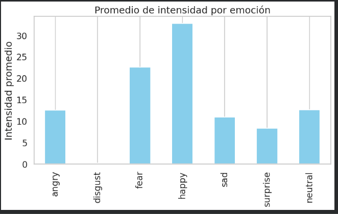
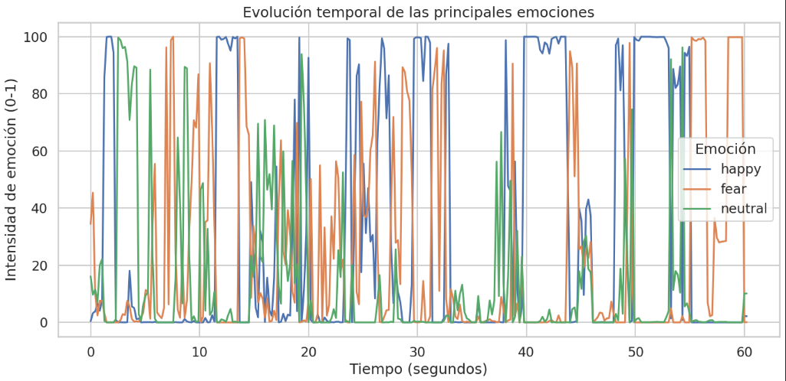
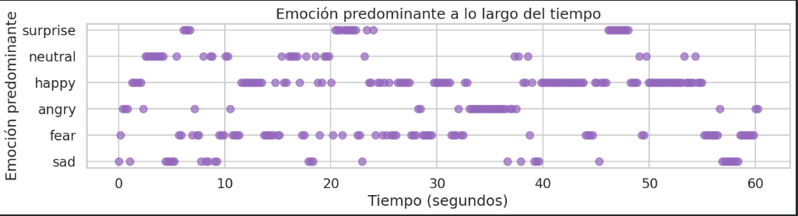
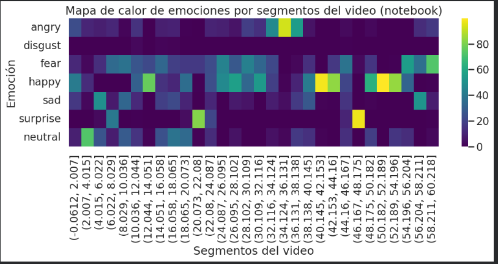
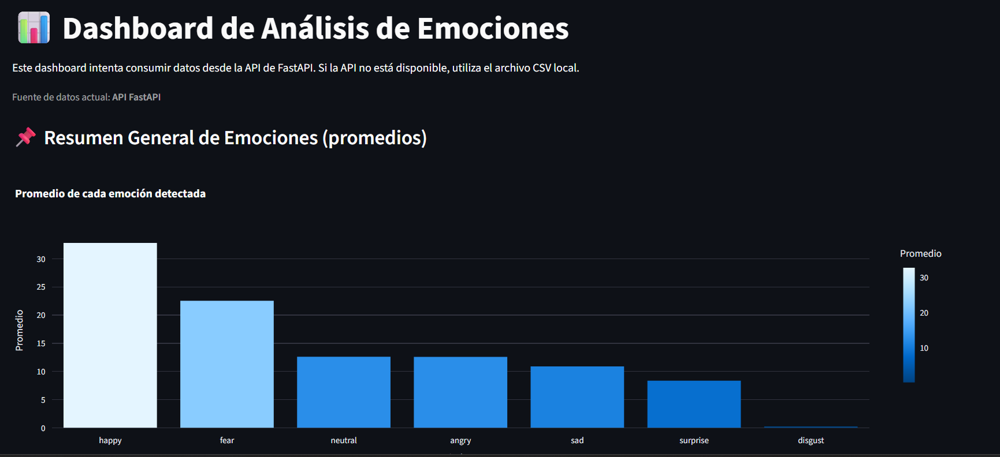
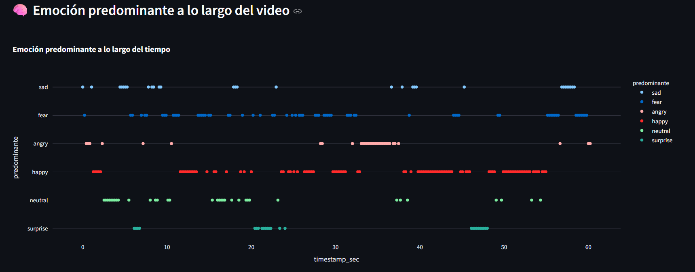
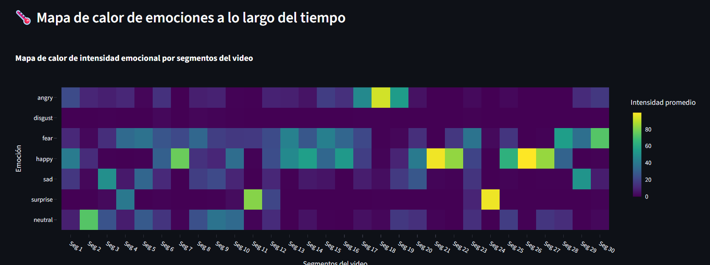
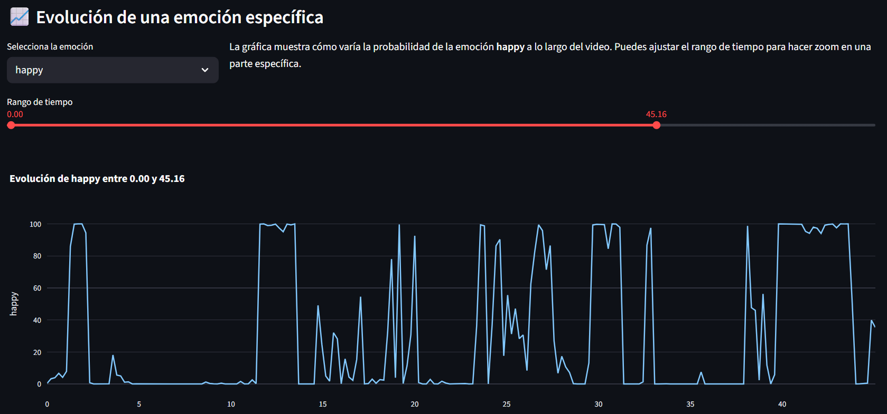

# 📊 Proyecto 8 – Análisis Automatizado de Emociones en Video

Sistema completo para *detectar, analizar y visualizar emociones faciales* a partir de un video.
El proyecto integra un *Notebook de análisis (Google Colab), una **API REST (FastAPI)* y un
*Dashboard interactivo (Streamlit)*.

---

## 🎯 Objetivo del proyecto

- Detectar emociones faciales *frame por frame* a partir de un video.
- Generar un dataset extendido para análisis (CSV).
- Exponer los resultados mediante una *API REST*.
- Visualizar métricas y tendencias en un *dashboard*.

---

## 🧩 Tecnologías utilizadas

- *Python 3.10+*
- *DeepFace* (Emotion Analysis)
- *Pandas / NumPy* (procesamiento)
- *Matplotlib / Plotly* (gráficas)
- *FastAPI + Uvicorn* (API REST)
- *Streamlit* (dashboard)
- *Google Colab* (ejecución del notebook)

---

## 🔄 Flujo general del sistema

text
Video (MP4)
  ↓
Notebook (DeepFace analiza frames)
  ↓
CSV extendido (emociones por frame + probabilidades)
  ↓
FastAPI (expone endpoints para consumir datos)
  ↓
Streamlit Dashboard (visualización y métricas)

📁 Estructura del repositorio

Proyecto-8-Analisis-Emociones/
│
├── api/
│   ├── api_app.py               # API FastAPI (lee CSV y entrega JSON)
│   └── requirements.txt
│
├── Dashboard/
│   ├── dashboard_app.py         # Dashboard Streamlit (API + fallback CSV)
│   └── requirements.txt
│
├── data/
│   └── emotions_extended.csv    # CSV final (tabular, listo para análisis)
│
├── notebook/
│   └── analisis_emociones.ipynb # Notebook (procesa video → genera CSV)
│
├── images/
│   ├── dashboard.png            # Captura del dashboard
|   |── dashboard_1.png
|   |── dashboard_2.png
|   |── dashboard_3.png
│   ├── graf_01_resumen.png       # (Placeholder) barras de promedios
│   ├── graf_02_tiempo.png        # (Placeholder) evolución temporal
│   ├── graf_03_predominante.png  # (Placeholder) emoción predominante por tiempo
│   └── graf_04_heatmap.png       # (Placeholder) heatmap (Viridis)
│
└── README.md

✅ Paso a paso de ejecución (recomendado)

1) Notebook (Google Colab) – Procesamiento del video
En esta fase se hace:

Carga del video (.mp4)

Muestreo de frames (frame_skip)

Detección de emoción por frame

Creación del dataset extendido (emotions_extended.csv)

📌 Salida final de esta fase:

data/emotions_extended.csv

Leyenda de gráficos (Notebook):

Gráfico 1: Promedio de emociones

Gráfico 2: Evolución temporal de una emoción

Gráfico 3: Emoción predominante a lo largo del tiempo

Gráfico 4: Heatmap de correlación de emociones

2) API (FastAPI) – Exposición de datos

La API toma como fuente el CSV generado por el notebook.

▶️ Ejecutar API
cd api
pip install -r requirements.txt
uvicorn api_app:app --reload
API disponible en:

text
Copy code
http://127.0.0.1:8000

📌 La API debe leer el archivo:

../data/emociones_anuncio_expandido.csv

3) Dashboard (Streamlit) – Visualización
El dashboard consume datos desde la API; si la API no está disponible,
usa el CSV local como respaldo (fallback).

▶️ Ejecutar Dashboard

cd Dashboard
pip install -r requirements.txt
streamlit run dashboard_app.py

📈 Resultados y visualizaciones

1) Promedio de emociones

2) Emoción predominante a lo largo del tiempo

3) Heatmap de correlación (Viridis)

4) Evolución de una emoción

📌 Notas importantes

El archivo emotions_extended.csv es el dataset final recomendado para análisis
(tabular, limpio, y compatible con API/dashboard).

El heatmap es un gráfico global y no necesita filtros.

Si la API no está disponible, el dashboard utiliza el CSV local

✨ Autores

RICHARD KEVIN AGUDO UBE
RICHARTH ALFREDO LAFUNA BUSTOS
CARLA ALEXANDRA RAMIREZ EGAS
SOFIA MONSERRATH SANDOVAL MORALES

Proyecto desarrollado para Proyecto 8 – Análisis de Emociones, integrando visión artificial, APIs y visualización interactiva.
